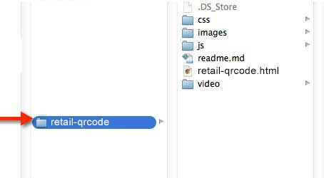
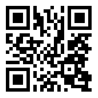

# Retail 

## Introduction

The Retail QR Code The Retail QR Code Template was created to promote a product while offering a QR code to scan for a coupon takeaway. A preview of the template can be seen here: http://rise-vision.github.io/content-templates/retail-qrcode/retail-qrcode.html

##Steps to run the Retail QR Code Template:##

1. Fork or download the entire content-templates repository.  


2. Modify the files within the retail folder directory to fit your needs (see below on how to modify specific elements).  


3. Host the entire “retail” folder directory in rise vision storage or your web hosting service.  


4. Copy the link to the retail-qrcode.html file where you have it hosted and insert the url into a schedule. (you can also add this link to the url gadget within a presentation)  


##Directions to Modify the Retail QR Code Template:##

####Changing the Animated Background Image
Open retail-qrcode.html, locate the following code and modify the src url of the source tag to the path of your new background:

```
<div id="background">
	
</div>
```

The style of the animation is done within css/style-main.css file. Look for the keyframes called ```@-webkit-keyframes "slidein"```.
 
####Changing the Quote Text
Open retail-qrcode.html, the quote content is nested within the div ```<div id="quote-container">``` Modify the text within the span tags to meet your needs. 

The style of the quote content is controlled within css/style-main.css. Look for the comment called ```Quote Content```.

####Changing the QR Code
Open retail-qrcode.html, locate the following code and modify the src url of the source tag to the path of your qr code graphic.:

```

```

The animation is done within css/qrcode-animation.css file. Look for the keyframes called ```@-webkit-keyframes "scan"``` and ```@-webkit-keyframes "pulse"```.
 
 
####Changing the QR Code Destination Page
When a user scans the qr code they will be taken to the coupon.html page. The style of this page is controlled by the css/coupon.css. 
If you would like it to continue to take people to this page do not change the qr graphic. 

####Miscellaneous Items
The text size and various other elements within css files use viewport sizing.
This is a way to dynamically size elements without the use of media queries.
For more information I suggest this article: http://css-tricks.com/viewport-sized-typography/

## Built With
actual tools used
- HTML
- CSS
- Javascript

Retail QR Code Template works in conjunction with [Rise Vision](http://www.risevision.com), the [digital signage management application](http://rva.risevision.com/) that runs on [Google Cloud](https://cloud.google.com).

At this time Chrome is the only browser that this project and Rise Vision supports.

## Submitting Issues
If you encounter problems or find defects we really want to hear about them. If you could take the time to add them as issues to this Repository it would be most appreciated. Please Identify the specific template that has the issue and follow the following format where applicable:

**Reproduction Steps**

1. did this
2. then that
3. followed by this (screenshots / video captures always help)

**Expected Results**

What you expected to happen.

**Actual Results**

What actually happened. (screenshots / video captures always help)

## Contributing
All contributions are greatly appreciated and welcome! If you would first like to sound out your contribution ideas please post your thoughts to our [community](http://community.risevision.com), otherwise submit a pull request and we will do our best to incorporate it.

### Suggested Contributions
- Alternative ways to animate background
- Alternative ways to engage users to scan qr code
- i18n Language Support

## Resources
If you have any questions or problems please don't hesitate to join our lively and responsive community at http://community.risevision.com.

If you are looking for user documentation on Rise Vision please see http://www.risevision.com/help/users/

If you would like more information on developing applications for Rise Vision please visit http://www.risevision.com/help/developers/.

 If you have any questions or problems please don't hesitate to join our lively and responsive community at http://community.risevision.com.
 
**Additional Content Templates can be found here: https://github.com/Rise-Vision/content-templates**

**Facilitator**

[Mathew Meiers](https://github.com/mmeiers "Mathew Meiers")